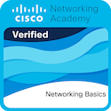
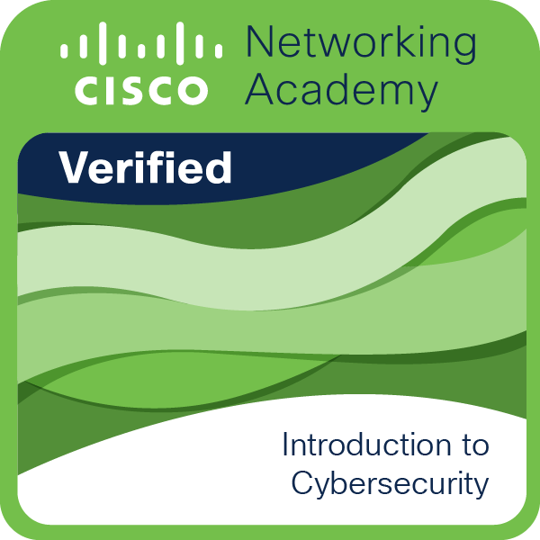

# 🏆 Badges & Certifications

Here are the certifications and achievements from my Cybersecurity learning journey.

### Cisco Networking Academy

**Networking Basics** — April 27, 2026

**Introduction to Cybersecurity** — April 16, 2026

### English Proficiency

**[EF SET English Certificate](./../certificates/ef-set-c1.pdf)**  
**EF SET English** – **C1 Proficient** — April 27, 2026

### In Progress
- Cisco Junior Cybersecurity Analyst Career Path
- Cisco Cybersecurity Defense Analyst Career Path
- CS50 Introduction to Cybersecurity (Harvard)
- Splunk Fundamentals 1
- Microsoft Sentinel

---

*Full PDF certificates are available in the [Certificates folder](./../certificates/).*
